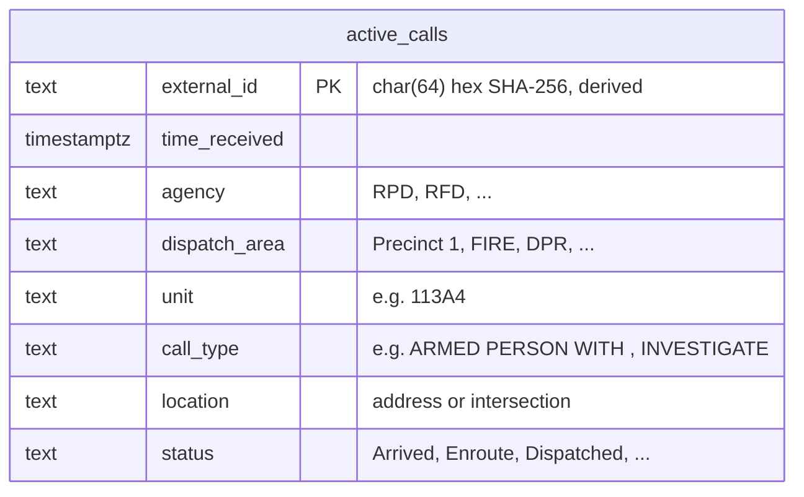
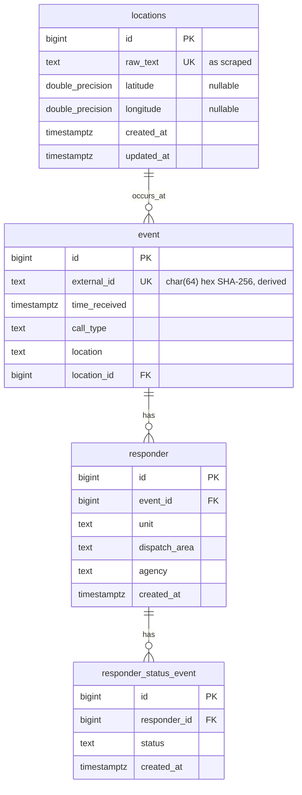
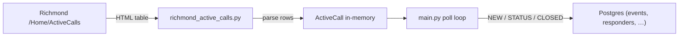
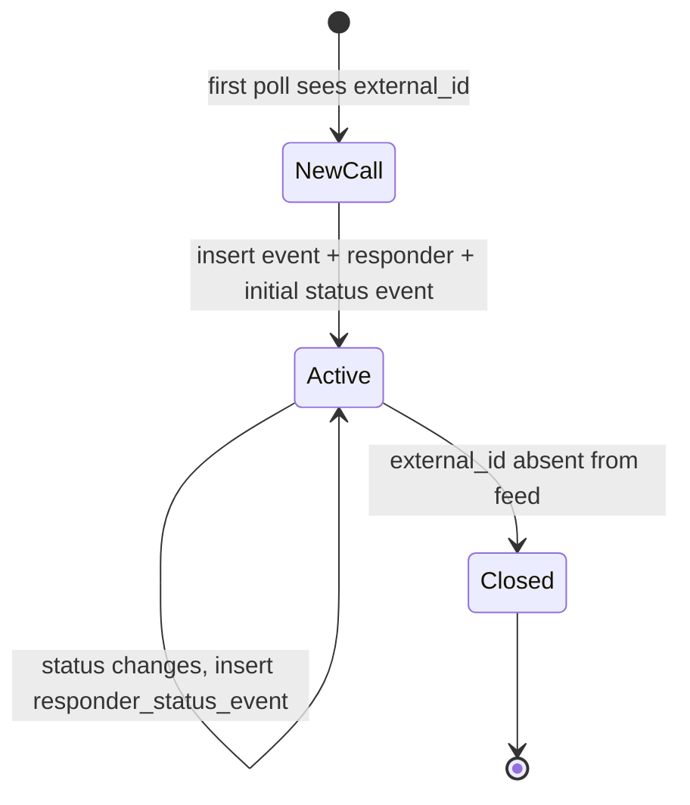

# Dispatch Map — Entity Relationship Diagram

This document describes the data model for dispatch-map using **PostgreSQL conventions**: plural `snake_case` table names, `snake_case` columns, `timestamptz` for timestamps, `bigint` surrogate keys, and `*_id` foreign-key columns.

## Conventions

| Convention | Example |
|------------|---------|
| Table names | plural `snake_case` — `events`, `responders`, `responder_status_events`, `locations` |
| Primary keys | `id bigserial` (auto-incrementing `bigint`) |
| Foreign keys | `{table_singular}_id bigint` — `event_id`, `location_id` |
| Natural / external keys | `code`, `external_id` with `UNIQUE` constraints |
| Timestamps | `timestamptz NOT NULL DEFAULT now()` |
| Text | `text` (preferred over `varchar` unless length-bound) |
| Coordinates | `double precision` |
| Row metadata | `created_at`, `updated_at` on all tables |

Suggested constraint naming:

- Primary key: `{table}_pkey`
- Foreign key: `{table}_{column}_fkey`
- Unique: `{table}_{column}_key` or `uq_{table}_{column}`

## Current scraper model

The consumer today parses Richmond's HTML table into a flat in-memory record. `call_id` is a SHA-256 hash of `agency`, `unit`, `call_type`, and `location` — in Postgres this maps to `events.external_id`. Each Richmond HTML row maps 1:1 to one `events` row and one `responders` row (because `unit` and `agency` are part of the hash).



## Proposed normalized schema

An **event** represents a dispatch call (type + location + time). Each scraped row also carries a **responder** (agency, dispatch area, unit). Status changes append rows to **responder_status_event** rather than overwriting a column. **locations** is the only lookup/dimension table, used for geocoding.



## Example DDL

Illustrative Postgres definitions for the core tables:

```sql
CREATE TABLE locations (
    id          bigserial PRIMARY KEY,
    raw_text    text NOT NULL UNIQUE,
    latitude    double precision,
    longitude   double precision,
    created_at  timestamptz NOT NULL DEFAULT now(),
    updated_at  timestamptz NOT NULL DEFAULT now()
);

CREATE TABLE events (
    id            bigserial PRIMARY KEY,
    external_id   char(64) NOT NULL UNIQUE,
    time_received timestamptz NOT NULL,
    call_type     text NOT NULL,
    location      text NOT NULL,
    location_id   bigint REFERENCES locations (id),
    created_at    timestamptz NOT NULL DEFAULT now(),
    updated_at    timestamptz NOT NULL DEFAULT now()
);

CREATE TABLE responders (
    id             bigserial PRIMARY KEY,
    event_id       bigint NOT NULL REFERENCES events (id),
    unit           text NOT NULL,
    dispatch_area  text NOT NULL,
    agency         text NOT NULL,
    created_at     timestamptz NOT NULL DEFAULT now()
);

CREATE TABLE responder_status_events (
    id           bigserial PRIMARY KEY,
    responder_id bigint NOT NULL REFERENCES responders (id),
    status       text NOT NULL,
    created_at   timestamptz NOT NULL DEFAULT now()
);

CREATE INDEX idx_events_external_id ON events (external_id);
CREATE INDEX idx_events_time_received ON events (time_received DESC);
CREATE INDEX idx_responders_event_id ON responders (event_id);
CREATE INDEX idx_responder_status_events_responder_id ON responder_status_events (responder_id, created_at DESC);
```

## Data flow

How scraped records move through the system today and where they land in the proposed schema.



## Field mapping

| Richmond table column | `ActiveCall` field | Postgres target |
|-----------------------|-------------------|-----------------|
| Time Received | `time_received` | `events.time_received` |
| Agency | `agency` | `responders.agency` |
| Dispatch Area | `dispatch_area` | `responders.dispatch_area` |
| Unit | `unit` | `responders.unit` |
| Call Type | `call_type` | `events.call_type` |
| Location | `location` | `locations.raw_text` → `events.location_id` (also stored denormalized on `events.location`) |
| Status | `status` | `responder_status_events.status` (initial row on insert) |

## Identity and change tracking



- **Stable identity:** `external_id` = `encode(sha256(agency || unit || call_type || location), 'hex')` → stored as `events.external_id`
- **Status changes:** same `external_id`, new status → append to `responder_status_events` (skip if status unchanged)
- **Closure:** `external_id` missing on a later poll → responder considered closed (application-level for now; no `is_active` column in the simplified schema)
