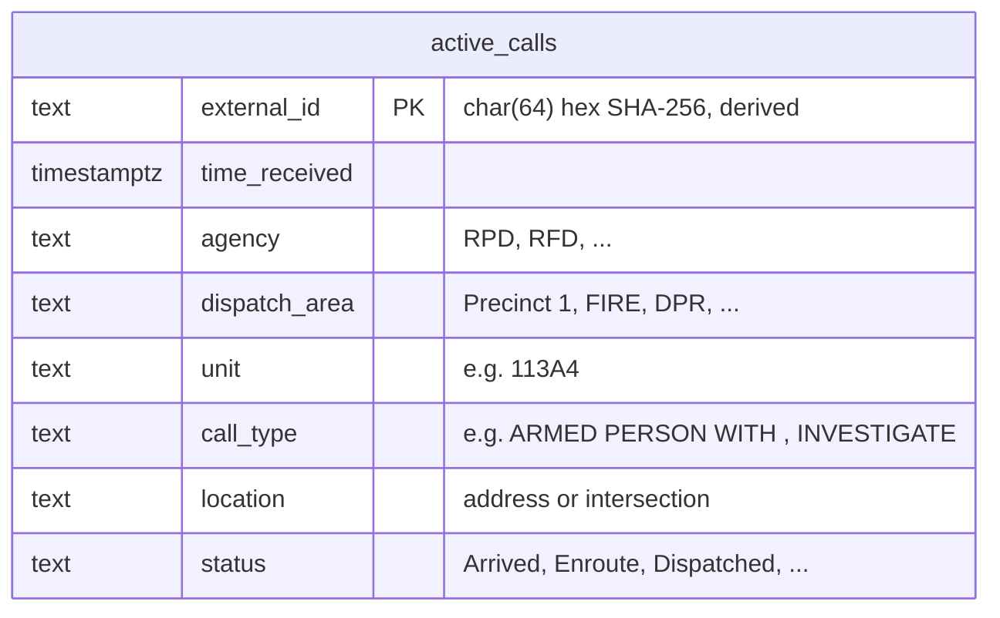
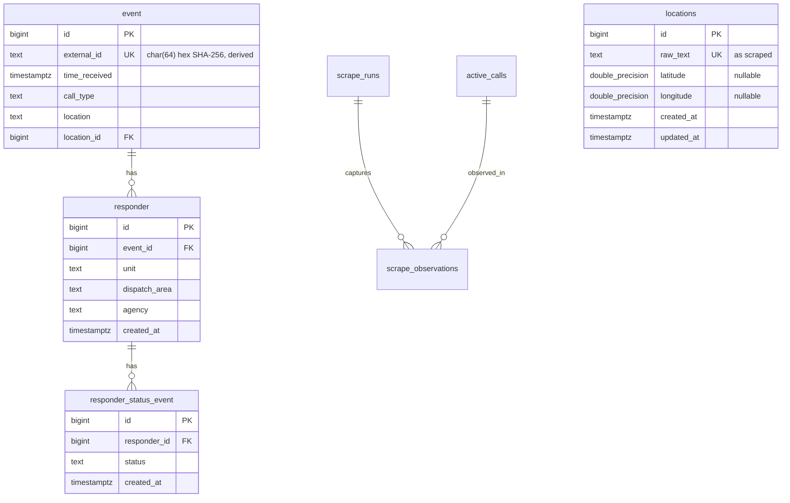
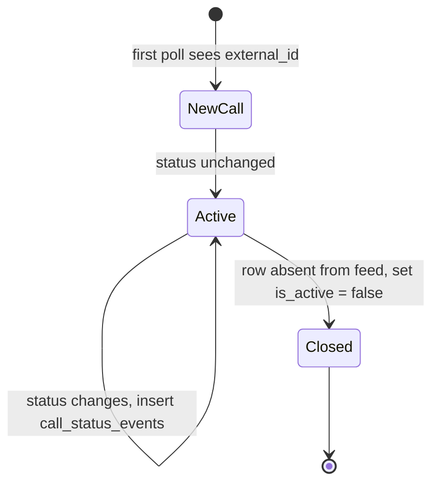

# Dispatch Map — Entity Relationship Diagram

This document describes the data model for dispatch-map using **PostgreSQL conventions**: plural `snake_case` table names, `snake_case` columns, `timestamptz` for timestamps, `bigint` surrogate keys, and `*_id` foreign-key columns.

## Conventions

| Convention | Example |
|------------|---------|
| Table names | plural `snake_case` — `active_calls`, `call_status_events` |
| Primary keys | `id bigserial` (auto-incrementing `bigint`) |
| Foreign keys | `{table_singular}_id bigint` — `agency_id`, `location_id` |
| Natural / external keys | `code`, `external_id` with `UNIQUE` constraints |
| Timestamps | `timestamptz NOT NULL DEFAULT now()` |
| Text | `text` (preferred over `varchar` unless length-bound) |
| Coordinates | `double precision` |
| Row metadata | `created_at`, `updated_at` on all tables |

Suggested constraint naming:

- Primary key: `{table}_pkey`
- Foreign key: `{table}_{column}_fkey`
- Unique: `{table}_{column}_key` or `uq_{table}_{column}`

## Current scraper model

The consumer today parses Richmond's HTML table into a flat in-memory record. `call_id` is a SHA-256 hash of `agency`, `unit`, `call_type`, and `location` — in Postgres this maps to `active_calls.external_id`.



## Proposed normalized schema

Dimension tables hold repeated values; fact tables store calls, status history, and scrape observations.



## Example DDL

Illustrative Postgres definitions for the core tables:

```sql
CREATE TABLE agencies (
    id          bigserial PRIMARY KEY,
    code        text NOT NULL UNIQUE,
    name        text NOT NULL,
    created_at  timestamptz NOT NULL DEFAULT now(),
    updated_at  timestamptz NOT NULL DEFAULT now()
);

CREATE TABLE call_statuses (
    code        text PRIMARY KEY,
    created_at  timestamptz NOT NULL DEFAULT now()
);

CREATE TABLE active_calls (
    id                  bigserial PRIMARY KEY,
    external_id         char(64) NOT NULL UNIQUE,
    time_received       timestamptz NOT NULL,
    agency_id           bigint NOT NULL REFERENCES agencies (id),
    dispatch_area_id    bigint NOT NULL REFERENCES dispatch_areas (id),
    unit_id             bigint NOT NULL REFERENCES units (id),
    call_type_id        bigint NOT NULL REFERENCES call_types (id),
    location_id         bigint NOT NULL REFERENCES locations (id),
    status_code         text NOT NULL REFERENCES call_statuses (code),
    first_seen_at       timestamptz NOT NULL,
    last_seen_at        timestamptz NOT NULL,
    is_active           boolean NOT NULL DEFAULT true,
    created_at          timestamptz NOT NULL DEFAULT now(),
    updated_at          timestamptz NOT NULL DEFAULT now()
);

CREATE INDEX idx_active_calls_agency_id ON active_calls (agency_id);
CREATE INDEX idx_active_calls_is_active ON active_calls (is_active) WHERE is_active = true;
CREATE INDEX idx_active_calls_time_received ON active_calls (time_received DESC);
```

## Data flow

How scraped records move through the system today and where they land in the proposed schema.


## Field mapping

| Richmond table column | `ActiveCall` field | Postgres target |
|-----------------------|-------------------|-----------------|
| Time Received | `time_received` | `active_calls.time_received` |
| Agency | `agency` | `agencies.code` → `active_calls.agency_id` |
| Dispatch Area | `dispatch_area` | `dispatch_areas.name` → `active_calls.dispatch_area_id` |
| Unit | `unit` | `units.designation` → `active_calls.unit_id` |
| Call Type | `call_type` | `call_types.description` → `active_calls.call_type_id` |
| Location | `location` | `locations.raw_text` → `active_calls.location_id` |
| Status | `status` | `call_statuses.code` → `active_calls.status_code` |

## Identity and change tracking



- **Stable identity:** `external_id` = `encode(sha256(agency || unit || call_type || location), 'hex')`
- **Status changes:** same `external_id`, new `status_code` → row in `call_status_events`
- **Closure:** `external_id` missing on a later poll → `is_active = false`, `last_seen_at` unchanged
