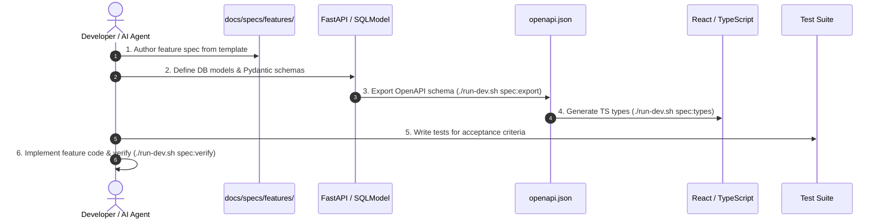

# Spec-Driven Development (SDD) Guide

Welcome to the **dispatch-map** specification repository. All new features, schema updates, API mutations, and data ingestion pipelines follow the **Spec-Driven Development** methodology.

---

## The Core Principle

> **The Specification is the Executable Source of Truth.**
> Code, types, tests, and documentation are downstream artifacts derived from formal specifications.

No non-trivial feature or breaking contract change should be implemented without an approved specification in this directory.

---

## Directory Structure

```
docs/specs/
├── README.md                      # This guide
├── templates/                     # Standardized spec templates
│   ├── feature_spec_template.md   # Full-stack / user-facing feature spec
│   └── api_contract_template.md   # REST / SSE endpoint contract spec
├── features/                      # Accepted & in-progress feature specs
│   └── 001-sample-feature.md
└── contracts/                     # API and data contract definitions
```

---

## The 5-Step Feature Lifecycle



### Step 1: Author the Specification
- Copy `docs/specs/templates/feature_spec_template.md` to `docs/specs/features/<feature-name>.md`.
- Fill out:
  - **Goal & User Story**: What problem are we solving?
  - **Scope Boundaries**: What is strictly in scope vs out of scope?
  - **Contract & Schema Changes**: SQLModel tables, Pydantic request/response models.
  - **Failure Modes & Edge Cases**: What happens on network errors, invalid data, empty state?
  - **Executable Acceptance Criteria**: Exact checklist and test criteria.

### Step 2: Define Schema Contracts First
- Update `packages/db/src/db/models.py` (database models).
- Update `packages/api/schemas.py` and routers (API models).
- If database columns changed, generate and verify Alembic migrations:
  ```bash
  uv run --directory packages/migrations alembic revision --autogenerate -m "describe change"
  ```

### Step 3: Synchronize Contracts Automatically
- Never manually retype TypeScript interfaces for API payloads.
- Run:
  ```bash
  ./run-dev.sh spec:types
  ```
- This exports `packages/api/openapi.json` and runs `openapi-typescript` to update `packages/web/src/types/api.generated.ts`.

### Step 4: Write Acceptance Tests First
- Add backend test cases in `packages/api/tests/` matching acceptance criteria.
- Add consumer/parser test cases in `packages/dispatch-consumer/tests/` if data ingestion changed.

### Step 5: Implement and Verify
- Implement frontend and backend application logic.
- Run full verification:
  ```bash
  ./run-dev.sh spec:verify
  ```
- All tests, schema checks, TypeScript builds, and linters must pass before committing.
