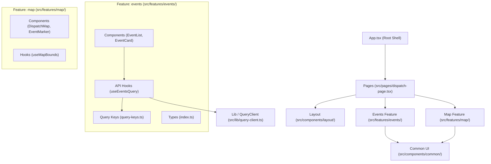

# Web Package Architecture & Directory Structure Plan

This proposal outlines the structure and file organization for `packages/web` in the **dispatch-map** monorepo, covering **pages**, **component hierarchy**, and **custom TanStack Query hooks**.

---

## Goal Description

The `packages/web` application is a Vite + React 19 + TypeScript frontend that displays emergency dispatch calls on an interactive Leaflet map and communicates with a FastAPI backend (`packages/api`) via REST (`/events`).

Currently, `packages/web/src` has a flat structure (`App.tsx`, `main.tsx`, `index.css`). We want a clean, scalable folder architecture that:
1. Organizes components into clear layers: **pages**, **layout**, **domain features**, and **common/shared UI**.
2. Establishes a scalable pattern for **TanStack React Query custom hooks** (query key factory, typed fetchers, and background refetching).
3. Configures path aliasing (`@/*`) in Vite and TypeScript.
4. Remains **100% forward-compatible** with Tailwind CSS, shadcn/ui, and a routing library (e.g. TanStack Router or React Router) when they are introduced in future tasks.

---

## Scope Boundary

> [!IMPORTANT]
> **Out of Scope (Deferred or Excluded)**:
> - **SSE / Realtime Streaming**: Any Server-Sent Events logic, `/items/stream` connections, and stream hooks are excluded. All data fetching is handled via standard REST polling / TanStack Query cache.
> - **Tailwind CSS & shadcn/ui**: Styling will remain CSS / standard styling for now. The `src/components/ui/` folder is reserved for atomic primitives so that when `npx shadcn@latest` is initialized in the future, it drops right in without moving files.
> - **Routing Library**: Neither React Router nor TanStack Router will be installed in this phase. The application will use a lightweight page orchestrator in `App.tsx` (rendering `src/pages/dispatch-page.tsx`), maintaining clean separation so page components can be plugged directly into route definitions later.

---

## Architecture Overview: Feature-Based Organization

A **Feature-Based (Vertical Slice)** architecture groups domain logic (events, map) into self-contained feature directories, preventing root-level `components/` and `hooks/` directories from becoming cluttered.



---

## Proposed Directory Tree

```
packages/web/
├── vite.config.ts                  # Path alias '@' + API proxy (/events)
├── tsconfig.app.json               # Path alias baseUrl & paths (@/*)
├── package.json
└── src/
    ├── assets/                     # Static media (icons, SVGs)
    │
    ├── components/
    │   ├── ui/                     # Reserved for future primitive UI components (shadcn)
    │   ├── layout/                 # Page shell, header, sidebar frames
    │   │   ├── app-layout.tsx      # Main wrapper (header + content area)
    │   │   └── app-header.tsx      # Top bar (branding, controls)
    │   └── common/                 # Reusable cross-feature UI elements
    │       └── loading-spinner.tsx # Reusable loading spinner
    │
    ├── features/                   # Domain-driven feature slices
    │   ├── events/                 # 911 / CAD dispatch events domain
    │   │   ├── api/                # TanStack Query hooks, query keys & fetchers
    │   │   │   ├── query-keys.ts       # Query key factory
    │   │   │   ├── get-events.ts       # Typed fetcher for GET /events
    │   │   │   └── use-events-query.ts # TanStack useQuery wrapper hook
    │   │   ├── components/         # Event domain components
    │   │   │   ├── event-list.tsx      # List / drawer of dispatch events
    │   │   │   └── event-card.tsx      # Single event item display
    │   │   └── types/              # Event TypeScript interfaces
    │   │       └── index.ts
    │   │
    │   └── map/                    # Leaflet map domain
    │       ├── components/
    │       │   ├── dispatch-map.tsx    # Leaflet MapContainer + TileLayer
    │       │   └── event-marker.tsx    # Incident markers with popups
    │       └── hooks/
    │           └── use-map-bounds.ts   # Map viewport tracking hook
    │
    ├── hooks/                      # App-wide, generic utility hooks
    │   └── use-debounce.ts         # Generic debounce hook for search/inputs
    │
    ├── lib/                        # Singletons and shared utilities
    │   ├── api-client.ts           # Central fetch wrapper with error handling
    │   └── query-client.ts         # Configured TanStack QueryClient instance
    │
    ├── pages/                      # Page-level view orchestrators
    │   └── dispatch-page.tsx       # Primary view (composes Layout, Map & EventList)
    │
    ├── types/                      # Shared ambient/global types
    │   └── api.ts                  # Common API error and response types
    │
    ├── App.tsx                     # Top-level shell (renders DispatchPage; router-ready)
    ├── App.css                     # Application-level layout styles
    ├── main.tsx                    # Entry point mounting QueryClientProvider
    └── index.css                   # Base reset styles
```

---

## Detailed Component & Hook Specifications

### 1. TanStack Query Architecture (`src/features/events/api/` & `src/lib/`)

#### `src/lib/query-client.ts`
Centralizes QueryClient configuration:
```ts
import { QueryClient } from '@tanstack/react-query'

export const queryClient = new QueryClient({
  defaultOptions: {
    queries: {
      staleTime: 1000 * 30, // 30 seconds fresh
      refetchOnWindowFocus: false,
      retry: 2,
    },
  },
})
```

#### `src/features/events/api/query-keys.ts`
The **Query Key Factory** pattern ensures consistent keys across queries and cache invalidations:
```ts
export const eventKeys = {
  all: ['events'] as const,
  lists: () => [...eventKeys.all, 'list'] as const,
  list: (params: { hours?: number }) => [...eventKeys.lists(), params] as const,
  details: () => [...eventKeys.all, 'detail'] as const,
  detail: (id: number) => [...eventKeys.details(), id] as const,
}
```

#### `src/features/events/api/get-events.ts`
Strongly typed API client function targeting `/events`:
```ts
import type { EventWithCoords } from '../types'

export interface GetEventsParams {
  hours?: number
}

export async function getEvents({ hours = 24 }: GetEventsParams = {}): Promise<EventWithCoords[]> {
  const url = new URL('/events', window.location.origin)
  if (hours) url.searchParams.set('hours', String(hours))

  const res = await fetch(url.toString())
  if (!res.ok) {
    throw new Error(`Failed to fetch events: ${res.status} ${res.statusText}`)
  }
  return res.json()
}
```

#### `src/features/events/api/use-events-query.ts`
Custom hook wrapping TanStack's `useQuery`:
```ts
import { useQuery } from '@tanstack/react-query'
import { getEvents, type GetEventsParams } from './get-events'
import { eventKeys } from './query-keys'

export function useEventsQuery(params: GetEventsParams = {}) {
  return useQuery({
    queryKey: eventKeys.list(params),
    queryFn: () => getEvents(params),
    refetchInterval: 1000 * 30, // Polling refresh every 30s
  })
}
```

---

### 2. Component Hierarchy & Layering

1. **Pages (`src/pages/`)**:
   - `dispatch-page.tsx`: Coordinates state between the map and the event list (e.g., currently selected event ID, hovered marker). It invokes `useEventsQuery()` and passes data into feature components.
2. **Layout (`src/components/layout/`)**:
   - `app-layout.tsx`: Top-level flex/grid layout providing header and main viewport container.
   - `app-header.tsx`: App title ("Dispatch Map") and filter/refresh controls.
3. **Features (`src/features/`)**:
   - `features/events/components/event-list.tsx`: Sidebar/overlay listing recent incidents.
   - `features/events/components/event-card.tsx`: Individual incident card (call type, address, timestamp).
   - `features/map/components/dispatch-map.tsx`: Encapsulates Leaflet `MapContainer`, `TileLayer`, and maps over incidents to render `event-marker.tsx`.
4. **Common UI (`src/components/common/`)**:
   - `loading-spinner.tsx`: Standard loading spinner.
5. **Reserved Primitives (`src/components/ui/`)**:
   - Folder reserved for future shadcn components (`button.tsx`, `card.tsx`, `sheet.tsx`).

---

### 3. Path Aliases & Vite Proxy Configuration

#### `packages/web/vite.config.ts`
```ts
import path from 'node:path'
import react from '@vitejs/plugin-react'
import { defineConfig } from 'vite'

export default defineConfig({
  plugins: [react()],
  resolve: {
    alias: {
      '@': path.resolve(__dirname, './src'),
    },
  },
  server: {
    proxy: {
      '/events': {
        target: 'http://127.0.0.1:8000',
        changeOrigin: true,
      },
    },
  },
  build: {
    outDir: '../api/static/app',
    emptyOutDir: true,
  },
})
```

#### `packages/web/tsconfig.app.json`
```json
{
  "compilerOptions": {
    "baseUrl": ".",
    "paths": {
      "@/*": ["./src/*"]
    }
  }
}
```

---

## Proposed Changes

### Configuration
#### [MODIFY] `packages/web/vite.config.ts`
- Add `@` path alias pointing to `./src`.
- Configure `/events` proxy rule to point to `http://127.0.0.1:8000`.

#### [MODIFY] `packages/web/tsconfig.app.json`
- Add `baseUrl: "."` and `paths: { "@/*": ["./src/*"] }`.

---

### Core Libraries & Types
#### [NEW] `packages/web/src/lib/query-client.ts`
- Export pre-configured `QueryClient` instance.

#### [MODIFY] `packages/web/src/main.tsx`
- Import `queryClient` from `@/lib/query-client`.

#### [NEW] `packages/web/src/types/api.ts`
- Generic API response and error types.

---

### Feature: Events
#### [NEW] `packages/web/src/features/events/types/index.ts`
- Export `EventWithCoords` matching FastAPI SQLModel.

#### [NEW] `packages/web/src/features/events/api/query-keys.ts`
- Export `eventKeys` query key factory.

#### [NEW] `packages/web/src/features/events/api/get-events.ts`
- `getEvents` fetcher function.

#### [NEW] `packages/web/src/features/events/api/use-events-query.ts`
- `useEventsQuery` custom hook.

#### [NEW] `packages/web/src/features/events/components/event-card.tsx`
- Presentational card for a single call incident.

#### [NEW] `packages/web/src/features/events/components/event-list.tsx`
- Scrollable list of active incidents with selection handler.

---

### Feature: Map
#### [NEW] `packages/web/src/features/map/components/dispatch-map.tsx`
- Extracted and enhanced Leaflet `MapContainer` with marker rendering.

#### [NEW] `packages/web/src/features/map/components/event-marker.tsx`
- Leaflet `Marker` with `Popup` showing call details.

---

### Layout & Common UI
#### [NEW] `packages/web/src/components/common/loading-spinner.tsx`
- Loading spinner component.

#### [NEW] `packages/web/src/components/layout/app-header.tsx`
- Header bar with title and refresh status.

#### [NEW] `packages/web/src/components/layout/app-layout.tsx`
- Application shell structuring header and body.

---

### Pages & App
#### [NEW] `packages/web/src/pages/dispatch-page.tsx`
- Orchestrates `useEventsQuery`, `DispatchMap`, and `EventList`.

#### [MODIFY] `packages/web/src/App.tsx`
- Simplified root component rendering `DispatchPage` inside `AppLayout`.

---

## User Review Required

> [!NOTE]
> **No New External Dependencies Required**:
> The plan uses packages already installed in `packages/web` (`react`, `react-dom`, `@tanstack/react-query`, `leaflet`, `react-leaflet`, `vite`, `typescript`).

---

## Verification Plan

### Automated Tests & Quality Checks
1. **Type Checking & Build**:
   ```bash
   npm run build --prefix packages/web
   ```
   Validates that all `@/*` path aliases resolve properly and TypeScript passes with zero errors.

2. **Linting**:
   ```bash
   npm run lint --prefix packages/web
   ```
   Ensures code style and syntax adhere to project lint rules.

### Manual Verification
1. Start the Vite dev server (`npm run dev --prefix packages/web`).
2. Verify the map loads, markers render from `/events`, and the event list renders alongside the map.
3. Verify that directory structure cleanly separates features, pages, components, and hooks.
