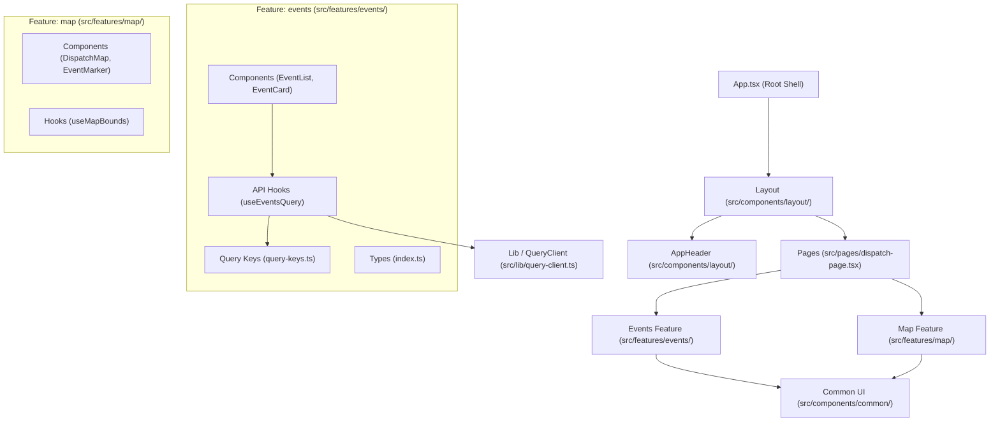
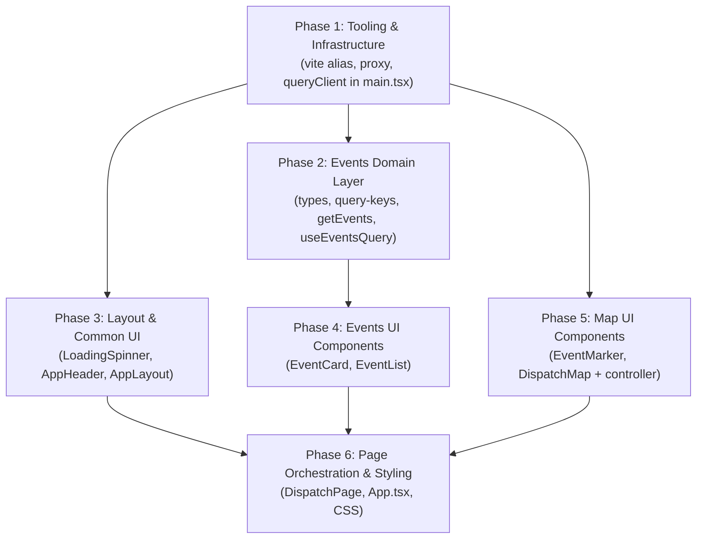

# Web Package Architecture & Phased Implementation Plan

This document outlines the architecture, directory structure, and **phased implementation plan** for `packages/web` in the **dispatch-map** monorepo, covering **pages**, **component hierarchy**, and **TanStack Query hooks**.

---

## Goal Description

The `packages/web` application is a Vite + React 19 + TypeScript frontend that displays emergency dispatch calls on an interactive Leaflet map and communicates with a FastAPI backend (`packages/api`) via REST (`/events`).

We are organizing `packages/web` into a modular, feature-based architecture (pages, domain features, layout, and common UI) executed across **6 small, executable, and testable phases** to ensure zero regressions and incremental verifiability.

---

## Scope Boundary

> [!IMPORTANT]
> **Out of Scope (Deferred or Excluded)**:
> - **SSE / Realtime Streaming**: Any Server-Sent Events logic, `/items/stream` connections, and stream hooks are excluded. All data fetching is handled via standard REST polling / TanStack Query cache.
> - **Tailwind CSS & shadcn/ui**: Styling will remain CSS / standard styling for now. The `src/components/ui/` folder is reserved for atomic primitives so that when `npx shadcn@latest` is initialized in the future, it drops right in without moving files.
> - **Routing Library**: Neither React Router nor TanStack Router will be installed in this phase. The application will use a lightweight page orchestrator in `App.tsx` (rendering `src/pages/dispatch-page.tsx`), maintaining clean separation so page components can be plugged directly into route definitions later.

---

## Architecture Overview: Feature-Based Organization

A **Feature-Based (Vertical Slice)** architecture groups domain logic (events, map) into self-contained feature directories, preventing root-level `components/` and `hooks/` directories from becoming cluttered.



---

## Proposed Directory Tree

```
packages/web/
├── vite.config.ts                  # Path alias '@' + API proxy (/events)
├── tsconfig.app.json               # Path alias paths (@/*)
├── package.json
└── src/
    ├── assets/                     # Static media (icons, SVGs)
    │
    ├── components/
    │   ├── ui/                     # Reserved for future primitive UI components (shadcn)
    │   ├── layout/                 # Page shell, header, sidebar frames
    │   │   ├── app-layout.tsx      # Main wrapper (header + content area)
    │   │   └── app-header.tsx      # Top bar (branding, controls)
    │   └── common/                 # Reusable cross-feature UI elements
    │       └── loading-spinner.tsx # Reusable loading spinner
    │
    ├── features/                   # Domain-driven feature slices
    │   ├── events/                 # 911 / CAD dispatch events domain
    │   │   ├── api/                # TanStack Query hooks, query keys & fetchers
    │   │   │   ├── query-keys.ts       # Query key factory
    │   │   │   ├── get-events.ts       # Typed fetcher for GET /events
    │   │   │   └── use-events-query.ts # TanStack useQuery wrapper hook
    │   │   ├── components/         # Event domain components
    │   │   │   ├── event-list.tsx      # List / drawer of dispatch events
    │   │   │   └── event-card.tsx      # Single event item display
    │   │   └── types/              # Event TypeScript interfaces
    │   │       └── index.ts
    │   │
    │   └── map/                    # Leaflet map domain
    │       ├── components/
    │       │   ├── dispatch-map.tsx    # Leaflet MapContainer + TileLayer
    │       │   └── event-marker.tsx    # Incident markers with popups
    │       └── hooks/
    │           └── use-map-bounds.ts   # Map viewport tracking hook
    │
    ├── hooks/                      # App-wide, generic utility hooks
    │   └── use-debounce.ts         # Generic debounce hook for search/inputs
    │
    ├── lib/                        # Singletons and shared utilities
    │   ├── api-client.ts           # Central fetch wrapper with error handling
    │   └── query-client.ts         # Configured TanStack QueryClient instance
    │
    ├── pages/                      # Page-level view orchestrators
    │   └── dispatch-page.tsx       # Primary view (composes Layout, Map & EventList)
    │
    ├── types/                      # Shared ambient/global types
    │   └── api.ts                  # Common API error and response types
    │
    ├── App.tsx                     # Top-level shell (renders DispatchPage; router-ready)
    ├── App.css                     # Application-level layout styles
    ├── main.tsx                    # Entry point mounting QueryClientProvider
    └── index.css                   # Base reset styles
```

---

## Detailed Specifications

### 1. TanStack Query Architecture (`src/features/events/api/` & `src/lib/`)

#### `src/lib/query-client.ts`
Centralizes QueryClient configuration:
```ts
import { QueryClient } from '@tanstack/react-query'

export const queryClient = new QueryClient({
  defaultOptions: {
    queries: {
      staleTime: 1000 * 30, // 30 seconds fresh
      refetchOnWindowFocus: false,
      retry: 2,
    },
  },
})
```

#### `src/features/events/api/query-keys.ts`
The **Query Key Factory** pattern ensures consistent keys across queries and cache invalidations:
```ts
export const eventKeys = {
  all: ['events'] as const,
  lists: () => [...eventKeys.all, 'list'] as const,
  list: (params: { hours?: number }) => [...eventKeys.lists(), params] as const,
  details: () => [...eventKeys.all, 'detail'] as const,
  detail: (id: number) => [...eventKeys.details(), id] as const,
}
```

#### `src/features/events/api/get-events.ts`
Strongly typed API client function targeting `/events`:
```ts
import type { EventWithCoords } from '../types/index.ts'

export interface GetEventsParams {
  hours?: number
}

export async function getEvents({ hours = 24 }: GetEventsParams = {}): Promise<EventWithCoords[]> {
  const url = new URL('/events', window.location.origin)
  if (hours) url.searchParams.set('hours', String(hours))

  const res = await fetch(url.toString())
  if (!res.ok) {
    throw new Error(`Failed to fetch events: ${res.status} ${res.statusText}`)
  }
  return res.json()
}
```

#### `src/features/events/api/use-events-query.ts`
Custom hook wrapping TanStack's `useQuery`:
```ts
import { useQuery } from '@tanstack/react-query'
import { getEvents, type GetEventsParams } from './get-events.ts'
import { eventKeys } from './query-keys.ts'

export function useEventsQuery(params: GetEventsParams = {}) {
  return useQuery({
    queryKey: eventKeys.list(params),
    queryFn: () => getEvents(params),
    refetchInterval: 1000 * 30, // Polling refresh every 30s
  })
}
```

---

## Phased Implementation Plan



---

### Phase 1: Tooling & Core Infrastructure
**Goal**: Configure path aliases (`@/*`) and backend proxy so subsequent feature files can use clean imports and proxy calls without breaking the existing build.

#### Changes:
- **[MODIFY] `packages/web/vite.config.ts`**:
  - Add `@` alias resolving to `./src` using `fileURLToPath(new URL('./src', import.meta.url))`.
  - Update proxy from `/items` to `/events` pointing to `http://127.0.0.1:8000`.
- **[MODIFY] `packages/web/tsconfig.app.json`**:
  - Configure `paths: { "@/*": ["./src/*"] }` (standalone without deprecated `baseUrl`).
- **[MODIFY] `packages/web/src/main.tsx`**:
  - Replace local `new QueryClient()` instantiation with `queryClient` imported from `@/lib/query-client.ts`.

#### Verification:
```bash
npm run build --prefix packages/web
npm run lint --prefix packages/web
```

---

### Phase 2: Events Domain Layer (Types & TanStack Query)
**Goal**: Build the data fetching and caching layer for emergency dispatch calls.

#### Changes:
- **[NEW] `packages/web/src/features/events/types/index.ts`**:
  - Define `EventWithCoords` matching the FastAPI SQLModel response schema.
- **[NEW] `packages/web/src/features/events/api/query-keys.ts`**:
  - Query key factory: `eventKeys.all`, `eventKeys.lists()`, `eventKeys.list(params)`, `eventKeys.detail(id)`.
- **[NEW] `packages/web/src/features/events/api/get-events.ts`**:
  - Typed fetcher `getEvents({ hours = 24 })` calling `/events?hours=...`.
- **[NEW] `packages/web/src/features/events/api/use-events-query.ts`**:
  - TanStack `useQuery` wrapper hook with 30s background refetch interval.

#### Verification:
```bash
npm run build --prefix packages/web
npm run lint --prefix packages/web
```

---

### Phase 3: Layout & Common UI Components
**Goal**: Create reusable presentation shell elements and loading indicators.

#### Changes:
- **[NEW] `packages/web/src/components/common/loading-spinner.tsx`**:
  - Reusable CSS loading spinner component.
- **[NEW] `packages/web/src/components/layout/app-header.tsx`**:
  - Header bar with title ("Dispatch Map"), live polling pulse dot, time range selector (6h, 12h, 24h, 48h, 7d), active incident count, and manual refresh button.
- **[NEW] `packages/web/src/components/layout/app-layout.tsx`**:
  - Shell component establishing header on top and full-height viewport body.

#### Verification:
```bash
npm run build --prefix packages/web
npm run lint --prefix packages/web
```

---

### Phase 4: Event Feature Components (Card & List)
**Goal**: Build the incident sidebar feed with search, status badges, and selection.

#### Changes:
- **[NEW] `packages/web/src/features/events/components/event-card.tsx`**:
  - Incident card displaying call type badge, formatted time, address, coordinates status, and active selection state.
- **[NEW] `packages/web/src/features/events/components/event-list.tsx`**:
  - Filter input for text search, incident count summary, scrollable card list, loading spinner, error message with retry, and selection callback.

#### Verification:
```bash
npm run build --prefix packages/web
npm run lint --prefix packages/web
```

---

### Phase 5: Map Feature Components (Markers & Leaflet Map)
**Goal**: Encapsulate Leaflet map container, custom marker rendering, and camera pan interactions.

#### Changes:
- **[NEW] `packages/web/src/features/map/components/event-marker.tsx`**:
  - Custom SVG/DivIcon Leaflet marker (color-coded by call type, pulsing pin) and `Popup` displaying incident metadata.
- **[NEW] `packages/web/src/features/map/components/dispatch-map.tsx`**:
  - Encapsulates `MapContainer`, `TileLayer`, marker iteration for geocoded events, and an internal map controller that smoothly pans/flies to an incident when selected.

#### Verification:
```bash
npm run build --prefix packages/web
npm run lint --prefix packages/web
```

---

### Phase 6: Page Orchestration, App Wiring & Styling
**Goal**: Wire the full system together into `DispatchPage`, update `App.tsx`, and apply modern command-center styling.

#### Changes:
- **[NEW] `packages/web/src/pages/dispatch-page.tsx`**:
  - Coordinates state: `hours` window filter, `selectedEventId`, `useEventsQuery({ hours })`.
  - Passes data and event handlers into `AppHeader`, `EventList`, and `DispatchMap`.
- **[MODIFY] `packages/web/src/App.tsx`**:
  - Renders `DispatchPage` inside `AppLayout`.
- **[MODIFY] `packages/web/src/App.css` & `packages/web/src/index.css`**:
  - Dark command-center theme (slate/indigo/amber dispatch accents).
  - Responsive split layout (sidebar + full map).
  - Custom Leaflet popup styling, scrollbar styling, and marker animations.

#### Verification:
1. **Automated Checks**:
   ```bash
   npm run build --prefix packages/web
   npm run lint --prefix packages/web
   ```
2. **Manual Check**:
   - Run `npm run dev --prefix packages/web` and verify map, sidebar, card selection, and filter interactions.

---

## User Review & Technical Notes

> [!NOTE]
> **No New External Dependencies Required**:
> The plan uses packages already installed in `packages/web` (`react`, `react-dom`, `@tanstack/react-query`, `leaflet`, `react-leaflet`, `vite`, `typescript`).

> [!IMPORTANT]
> **Leaflet Default Marker Icon Bundling in Vite**:
> Default Leaflet marker images (`marker-icon.png`, `marker-shadow.png`) often fail to resolve in modern Vite bundlers due to Leaflet's legacy relative URL detection. We will implement crisp SVG-based `L.divIcon` markers with dispatch status indicators, while also applying the standard Leaflet default icon fix as a fallback.
